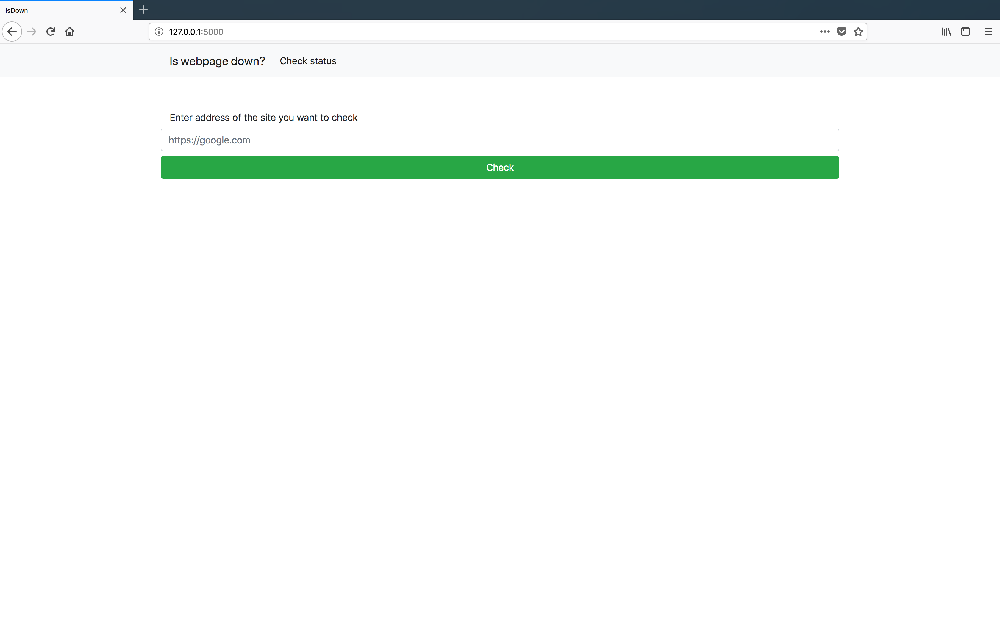
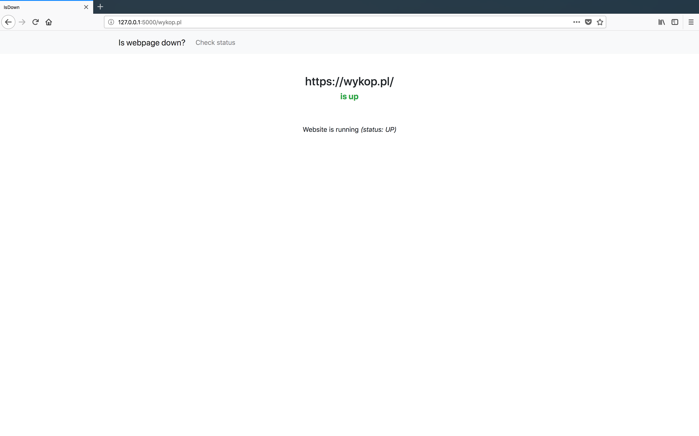

## isdown
Service availability checker - poor man's _downforeveryoneorjustme.com_

#### Usage

casual way, via browser:
* connect to `{server_name}:{port}` and type it
* type `{server_name}:{port}/{website_you_want_to_check}`, you'll be automatically redirected to status checker

pr0 way, via json api:
1) send POST data to `{server_name}:{port}/api/`
    * disclaimer: flask will automatically redirect non-POST data sent to API to normal checking endpoint
2) with `application/json` content-type
3) all you need to send is just `{"url": "{url or host or full address}"}`
4) and you'll receive
5) `{"description": "Server is up", "status": "UP", "url": "8.8.8.8"}`

#### States
* `SLOW` - when server responded but with a delay between 10-30 secs
* `DOWN` - when server is down or responded with delay larger than 30 secs
* `FLAPPY` - when server doesn't answer all of our probes
* `UP` - when everything is OK
* `HTTP_4xx` - when server returned HTTP 4xx error
* `HTTP_5xx` - when server returned HTTP 5xx error
* `CONN_ERR` - when we cannot reach host, e.g. it's not in our DNS 

#### Requirements
* Python 3.6 (should work with 3.3+ but not tested)
* *nix preffered, not tested on Windows

#### Installation (dev)
* `git clone` this repo && `cd` into it
* `python3 -m venv env`
* `pip install -r requirements.txt`
* `export FLASK_APP_ENVIRONMENT=Development`
* `python3 wsgi.py`

#### Installation (prod)
* set environmental variable `FLASK_APP_ENVIRONMENT` to a class name of settings class in `config.py`
* use your favourite wsgi server and point it to `wsgi.py::app`
* enjoy
